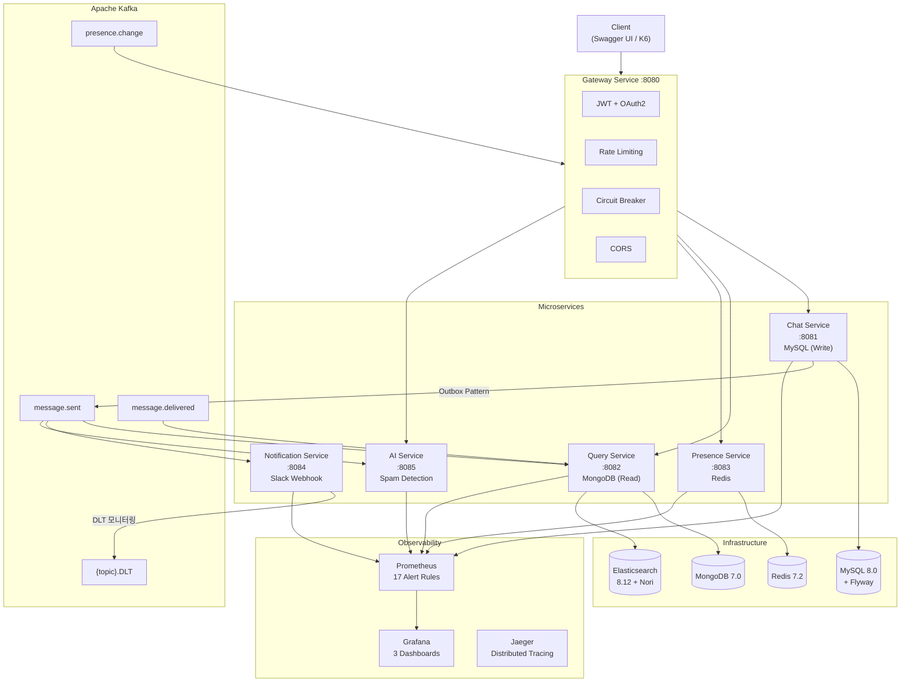
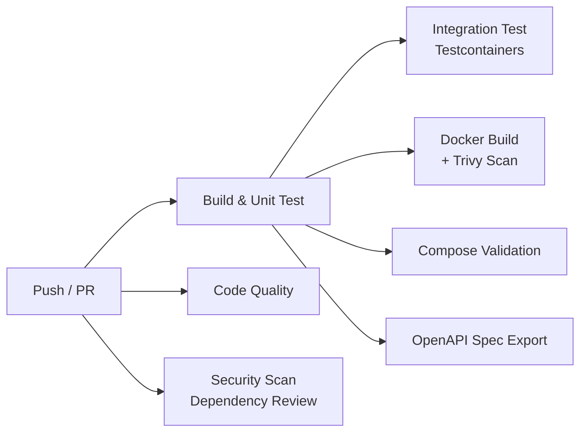
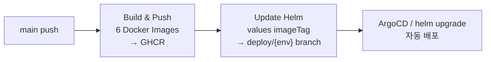

# messaging-engine

**실시간 메시징 백엔드 엔진** — MSA + CQRS + Event-Driven Architecture

[](https://github.com/minseo0943/messaging-engine/actions/workflows/ci.yml)
[](https://openjdk.org/)
[](https://spring.io/projects/spring-boot)
[](https://kafka.apache.org/)
[](LICENSE)

> 6개 마이크로서비스로 구성된 이벤트 기반 메시징 플랫폼.  
> CQRS, Transactional Outbox, Dead Letter Topic, Circuit Breaker, OAuth2 등  
> **프로덕션 레벨의 백엔드 아키텍처**를 프론트엔드 없이 순수 백엔드로 구현했습니다.

---

## Architecture



### CQRS Flow

```
1. POST /api/chat/rooms/{id}/messages  →  chat-service (MySQL + Outbox 저장, 같은 트랜잭션)
2. OutboxPoller  →  Kafka "message.sent" 발행 (DB-Kafka 원자성 보장)
3. query-service Consumer  →  MongoDB 비정규화 도큐먼트 + Elasticsearch 인덱싱
4. notification-service Consumer  →  Slack Webhook 알림 발송
5. ai-service Consumer  →  스팸 탐지 + 우선순위 분류
6. gateway-service Consumer  →  WebSocket(STOMP) 실시간 브로드캐스트
7. GET /api/query/rooms/{id}/messages  →  query-service (MongoDB 조회)
```

### Kafka Topics

| 토픽 | 파티션 키 | Producer → Consumer |
|------|----------|---------------------|
| `message.sent` | chatRoomId | chat → query, notification, ai, gateway |
| `message.delivered` | chatRoomId | chat → query |
| `message.edited` | chatRoomId | chat → query |
| `message.reaction` | chatRoomId | chat → query |
| `message.spam-detected` | messageId | ai → query, notification |
| `presence.change` | userId | presence → gateway |
| `{topic}.DLT` | — | Dead Letter (3회 재시도 실패) → notification (DLT Consumer) |

---

## Tech Stack

| 영역 | 기술 |
|------|------|
| Language | Java 17, Gradle 8.12 (Kotlin DSL) |
| Framework | Spring Boot 3.4.4 |
| Message Broker | Apache Kafka (Confluent 7.6) |
| Write DB | MySQL 8.0 + Flyway Migration |
| Read DB | MongoDB 7.0 (비정규화 읽기 모델) |
| Cache / Presence | Redis 7.2 |
| Search | Elasticsearch 8.12 + Nori 한글 형태소 분석기 |
| Resilience | Resilience4j (Circuit Breaker + Retry) |
| Auth | JWT + OAuth2 Kakao + Refresh Token Rotation |
| File Storage | MinIO (S3 호환) + Presigned URL |
| Tracing | Micrometer Tracing + OpenTelemetry → Jaeger |
| Metrics | Micrometer → Prometheus → Grafana |
| Load Test | K6 (smoke, e2e, spike, soak) |
| CI/CD | GitHub Actions (CI + CD + Load Test) |
| Container | Docker Compose + Helm Chart (K8s) |
| Container Tuning | G1GC, MaxRAMPercentage=75%, HeapDumpOnOOM |

---

## Project Structure

```
messaging-engine/
├── common/                  # 공유 라이브러리 (이벤트, DTO, 예외)
├── gateway-service/         # API Gateway + JWT + Rate Limiting + CORS + Circuit Breaker
├── chat-service/            # CQRS Command Side (MySQL → Outbox → Kafka)
├── query-service/           # CQRS Query Side (Kafka → MongoDB + ES)
├── presence-service/        # Redis 접속 상태 관리 + Graceful Degradation
├── notification-service/    # 알림 라우팅 (Slack) + DLT Consumer
├── ai-service/              # 스팸 탐지 (Strategy 패턴 규칙 엔진)
├── load-test/               # K6 부하 테스트 (smoke, e2e, spike, soak)
├── monitoring/              # Prometheus Alert Rules + Grafana Dashboards
├── helm/                    # Helm Chart (HPA, PDB, NetworkPolicy, ServiceMonitor)
├── k8s/                     # Kustomize manifests (base + overlays)
├── docs/                    # ADR (18건), 벤치마크, 트러블슈팅
│   ├── adr/                 # Architecture Decision Records
│   ├── benchmarks/          # Phase별 성능 측정 결과
│   ├── troubleshooting/     # 실제 장애 대응 기록
│   └── openapi/             # OpenAPI 스펙 (CI 자동 추출)
└── .github/workflows/       # CI + CD + Load Test 파이프라인
```

---

## Quick Start

```bash
# 1. 클론
git clone https://github.com/minseo0943/messaging-engine.git
cd messaging-engine

# 2. 전체 빌드
./gradlew build

# 3. Docker Compose로 전체 실행 (인프라 + 6개 서비스, 원클릭)
docker compose up -d

# 4. 헬스 체크 (모든 서비스 UP 확인)
curl http://localhost:8080/actuator/health

# 5. Swagger UI에서 API 테스트
open http://localhost:8080/swagger-ui.html

# 6. E2E 테스트로 전체 CQRS 파이프라인 검증
node load-test/e2e/test-runner.js
```

<details>
<summary>로컬 개발 모드 (서비스 개별 실행)</summary>

```bash
# 인프라만 실행
docker compose up -d kafka mysql mongodb redis elasticsearch jaeger prometheus grafana

# 각 서비스 개별 실행
./gradlew :gateway-service:bootRun --args='--spring.profiles.active=local'
./gradlew :chat-service:bootRun --args='--spring.profiles.active=local'
./gradlew :query-service:bootRun --args='--spring.profiles.active=local'
./gradlew :presence-service:bootRun --args='--spring.profiles.active=local'
./gradlew :notification-service:bootRun --args='--spring.profiles.active=local'
./gradlew :ai-service:bootRun --args='--spring.profiles.active=local'
```
</details>

---

## Test

### 테스트 피라미드

```
      ▲  E2E (~80개)         — K6/Node.js 전체 서비스 연동, CQRS 파이프라인 검증
      ■  통합 (5개)           — Testcontainers (MySQL + Kafka + MongoDB + Redis)
      █  단위 (164개)         — Service, Consumer, Controller, Rule 비즈니스 로직
```

리스크 기반 설계: Critical Path(메시지→Kafka→MongoDB→스팸)에 단위+E2E 양쪽에서 교차 검증.
자세한 테스트 전략은 [ADR-010](docs/adr/010-test-strategy.md) 참조.

```bash
# 단위 테스트 (전체)
./gradlew test

# 특정 모듈만
./gradlew :chat-service:test

# 통합 테스트 (Testcontainers)
./gradlew integrationTest

# E2E 테스트 (Docker Compose 실행 상태에서)
node load-test/e2e/test-runner.js          # 로컬: 38개 시나리오
node load-test/e2e/test-runner-docker.js   # Docker: 43개 시나리오

# K6 부하 테스트
k6 run load-test/e2e-scenario.js           # E2E 시나리오
k6 run load-test/spike-test.js             # Spike (10→500 VU)
k6 run load-test/soak-test.js              # Soak (25 VU × 25분, 메모리 릭 탐지)
```

---

## API Documentation

각 서비스의 Swagger UI:

| 서비스 | URL | 주요 API |
|--------|-----|----------|
| Gateway | `http://localhost:8080/swagger-ui.html` | 인증, 프록시 라우팅 |
| Chat | `http://localhost:8081/swagger-ui.html` | 메시지 CRUD, 채팅방, 파일 업로드 |
| Query | `http://localhost:8082/swagger-ui.html` | 메시지 조회, 검색, 통계 |
| Presence | `http://localhost:8083/swagger-ui.html` | 접속 상태 관리 |
| AI | `http://localhost:8085/swagger-ui.html` | 스팸 분석, 요약, 우선순위 |

> OpenAPI 스펙은 CI 파이프라인에서 자동 추출되어 `docs/openapi/`에 저장됩니다.

---

## Key Design Decisions

18개의 Architecture Decision Record로 모든 주요 설계를 문서화했습니다. 자세한 내용은 [docs/adr/](docs/adr/) 참조.

| # | 결정 | 핵심 이유 |
|---|------|----------|
| 001 | CQRS + 최종 일관성 | 읽기/쓰기 독립 스케일링, 각 DB 장점 활용 |
| 002 | Kafka 선택 | 순서 보장(파티션 키), 다중 Consumer, 이벤트 재처리 |
| 003 | @TransactionalEventListener | DB 커밋 후 이벤트 발행 보장 |
| 004 | MongoDB 읽기 모델 | 비정규화 친화, 스키마 유연성 |
| 005 | RestClient Gateway | 서블릿 스택 통일, 완전 제어 |
| 006 | Resilience4j Circuit Breaker | 서비스별 격리, 동적 CB 선택 |
| 007 | Kafka Dead Letter Topic | 3회 재시도 후 DLT 보존, 메시지 무유실 |
| 008 | Redis Graceful Degradation | 부가 기능 장애가 핵심 기능을 차단하면 안 됨 |
| 009 | Strategy 패턴 스팸 탐지 | OCP 준수, 규칙 추가 시 기존 코드 수정 없음 |
| 010 | 테스트 피라미드 전략 | 크리티컬 경로 기반 리스크 분석 |
| 011 | Kafka 수동 ACK | at-least-once 보장, DLT와 안전한 조합 |
| 012 | OAuth2 + Refresh Token Rotation | 토큰 탈취 대응, 세션 보안 |
| 013 | Presigned URL 파일 업로드 | 서버 부하 제거, S3 호환 |
| 014 | ES Edge N-gram 자동완성 | 한글 특성 고려 |
| 015 | Correlation ID 전파 | HTTP→MDC→Outbox→Kafka Header 전 구간 추적 |
| 016 | Transactional Outbox 패턴 | DB-Kafka 원자성 보장 |
| 017 | Idempotent Consumer | eventId 기반 중복 처리 방지 |
| 018 | Sliding Window Rate Limit | IP 기반 요청 제한 |

---

## Resilience (장애 복원력)

이 시스템은 **"장애가 발생해도 핵심 기능은 유지된다"**를 목표로 설계되었습니다.

| 장애 시나리오 | 대응 전략 | 결과 |
|-------------|----------|------|
| 다운스트림 서비스 장애 | Circuit Breaker (서비스별 독립) | 장애 서비스만 503, 나머지 정상 |
| 일시적 네트워크 끊김 | Retry (2회, 500ms) | 자동 복구 |
| Redis 완전 중단 | Graceful Degradation | 기본값(offline) 반환, 500 대신 200 |
| Kafka 브로커 다운 | Transactional Outbox | MySQL에 이벤트 보관, 복구 후 자동 발행 |
| Consumer 처리 실패 | Dead Letter Topic (3회 재시도) | DLT에 보존 + Micrometer 카운터 모니터링 |
| Consumer 중복 수신 | Idempotent Consumer (Redis SETNX) | eventId 기반 중복 감지, 실패 시 키 롤백 |
| query-service 다운 | Kafka offset 보존 | 복구 후 밀린 이벤트 자동 소비 |
| Gateway 스레드 고갈 | RestClient 타임아웃 (connect 3s, read 5s) | 무한 대기 방지 |

### Chaos Engineering 검증

4가지 장애 시나리오를 `docker stop`으로 실제 인프라를 중단시켜 검증했습니다.

| 시나리오 | 결과 | 핵심 발견 |
|---------|------|----------|
| Kafka 브로커 다운 | Outbox가 메시지 유실 완전 방지 | 복구 후 ~40초 내 자동 전파 |
| Redis 완전 중단 | Graceful Degradation 동작 | Mock/실제 예외 타입 불일치 버그 발견 → 수정 |
| chat-service 다운 | CQRS 격리 — 쓰기 죽어도 읽기 정상 | Gateway가 502 즉시 반환 |
| query-service 다운 | Kafka offset으로 자가 복구 | Consumer 재기동 시 자동 동기화 |

상세 결과: [docs/chaos-test-results.md](docs/chaos-test-results.md)

---

## Kafka Reliability

```
Producer: acks=all, enable.idempotence=true
  → 메시지 발행 보장 (at-least-once)

Transactional Outbox:
  → Message + OutboxEvent 같은 트랜잭션으로 저장
  → OutboxPoller (5초 주기)가 Kafka 발행 → published=true
  → Kafka 다운 시에도 MySQL에 이벤트 보관

Consumer: enable.auto.commit=false, ackMode=MANUAL
  → 처리 완료 후에만 오프셋 커밋

Error Recovery: DefaultErrorHandler + DeadLetterPublishingRecoverer
  → 3회 재시도 → {topic}.DLT 토픽에 보존

DLT Consumer (notification-service):
  → *.DLT 패턴 리스너로 실패 이벤트 자동 수집
  → Micrometer 카운터 (messaging.dlt.consumed) 모니터링
  → Prometheus 알림: 10분간 5건 초과 시 경고

Idempotent Consumer:
  → Redis SETNX (TTL 24h)로 중복 이벤트 방지
  → 처리 실패 시 Redis 키 롤백 → 재시도 가능
```

---

## Monitoring & Observability

| 도구 | URL | 용도 |
|------|-----|------|
| Grafana | `http://localhost:3000` (admin/admin) | 대시보드 3개 |
| Prometheus | `http://localhost:9090` | 메트릭 수집 + 17개 알림 규칙 |
| Jaeger | `http://localhost:16686` | 분산 트레이싱 |

### Grafana 대시보드 (3개)

| 대시보드 | 패널 수 | 주요 지표 |
|----------|---------|----------|
| **messaging-engine** | 8 | HTTP TPS, p95/p99 레이턴시, 에러율, JVM 힙 |
| **kafka-pipeline** | 6 | Consumer Lag, E2E 이벤트 지연, Outbox 미발행 |
| **business-metrics** | 8 | 메시지/초, DLT 메시지, SLO 준수율, CQRS Lag |

### Prometheus 알림 규칙 (8개 그룹, 17개 규칙)

| 그룹 | 알림 | 조건 | 심각도 |
|------|------|------|--------|
| 서비스 가용성 | ServiceDown | 1분 이상 무응답 | critical |
| | HighRestartRate | 10분 내 재시작 | warning |
| HTTP 에러 | HighErrorRate5xx | 5xx > 5% (2분) | critical |
| | HighErrorRate4xx | 4xx > 20% (5분) | warning |
| HTTP 레이턴시 | HighP99Latency | p99 > 2초 (3분) | warning |
| | HighP99Latency_Critical | p99 > 5초 (2분) | critical |
| Kafka | KafkaConsumerLagHigh | Lag > 1,000건 (5분) | warning |
| | KafkaConsumerLagCritical | Lag > 10,000건 (3분) | critical |
| | KafkaEventProcessingSlowP99 | E2E Lag > 10초 | warning |
| Outbox | OutboxUnpublishedHigh | 미발행 > 100건 (3분) | warning |
| | OutboxUnpublishedCritical | 미발행 > 1,000건 (1분) | critical |
| JVM | HighJvmHeapUsage | 힙 > 90% (5분) | warning |
| | HikariCPExhausted | 커넥션 대기 3분 | warning |
| DLT | DltMessageVolumeWarning | 10분간 > 5건 | warning |
| | DltMessageVolumeCritical | 10분간 > 50건 | critical |
| 비즈니스 | NoMessagesReceived | 10분간 메시지 0건 | warning |
| | HighDltRatio | DLT 비율 > 5% | warning |

### Custom Metrics

| 메트릭 | 설명 |
|--------|------|
| `gateway.proxy.duration` | Gateway → 하위 서비스 프록시 레이턴시 |
| `messaging.event.end_to_end.lag` | Kafka 발행 → Consumer 처리 완료 지연 |
| `messaging.event.projection.duration` | MongoDB 프로젝션 소요 시간 |
| `messaging.dlt.consumed` | DLT 메시지 수신 카운터 (original_topic 태그) |
| `ai.analysis.duration` | AI 분석 소요 시간 |
| `ai.analysis.spam.detected` | 스팸 감지 카운터 |

---

## Performance

### Phase별 성능 변화 추이

각 Phase에서 동일한 부하 패턴(10→50→100 VU)으로 측정하여 아키텍처 결정의 효과를 정량적으로 비교:

```
┌─────────────────────┬──────────┬──────────┬──────────┬──────────┐
│                     │ Phase 1  │ Phase 2  │ Phase 4  │  최종    │
│                     │ (REST)   │ (CQRS)   │ (Gateway)│ (전체)   │
├─────────────────────┼──────────┼──────────┼──────────┼──────────┤
│ 메시지 전송 TPS     │   72     │   85     │   78     │   82     │
│ 메시지 전송 p95     │  20ms    │  22ms    │  28ms    │  25ms    │
│ 메시지 조회 p95     │  27ms    │  12ms    │  18ms    │  12ms    │
│ CQRS 이벤트 지연    │   —      │  50ms    │  50ms    │  50ms    │
│ Presence 조회       │   —      │   —      │  4ms     │  0.8ms   │
│ 에러율              │  0%      │  0%      │  0%      │  0%      │
└─────────────────────┴──────────┴──────────┴──────────┴──────────┘
```

### Spike Test (10→500 VU)

| 구간 | p95 | 에러율 | 비고 |
|------|-----|--------|------|
| 정상 (10 VU) | ~25ms | 0% | 기준선 |
| 스파이크 (500 VU) | ~800ms | ~5% | 커넥션 풀 포화 |
| 복구 (10 VU) | ~30ms | 0% | **~10초 내 정상 복귀** |

### Soak Test (25 VU x 25분)

| 지표 | 시작 | 종료 | 판정 |
|------|------|------|------|
| JVM Heap | ~120MB | ~130MB | 메모리 릭 없음 |
| p99 | ~35ms | ~38ms | 레이턴시 안정 |
| Error Rate | 0% | 0% | 장시간 안정성 확인 |

### SLO 달성

| SLO | 목표 | 결과 | 상태 |
|-----|------|------|------|
| 메시지 전송 p95 | < 500ms | 25ms | 달성 |
| 메시지 전송 p99 | < 1000ms | 40ms | 달성 |
| 메시지 조회 p95 | < 200ms | 12ms | 달성 |
| 에러율 (정상) | < 1% | 0% | 달성 |
| 스파이크 복구 시간 | < 30s | ~10s | 달성 |

상세 분석: [docs/benchmarks/](docs/benchmarks/) (Phase별 벤치마크 보고서)

### K6 부하 테스트 스크립트

```bash
k6 run load-test/send-message.js       # 단일 API 기준선
k6 run load-test/e2e-scenario.js       # 전체 파이프라인 E2E
k6 run load-test/spike-test.js         # 스파이크 (10→500 VU)
k6 run load-test/soak-test.js          # Soak (25 VU × 25분)
k6 run load-test/phase4-load-test.js   # Gateway 경유 테스트
```

---

## Security

| 영역 | 구현 |
|------|------|
| 인증 | JWT Access Token (15분) + Refresh Token (7일) |
| OAuth2 | Kakao 소셜 로그인 + Authorization Code Flow |
| 토큰 보안 | Refresh Token Rotation (탈취 시 전체 무효화) |
| API 보호 | Rate Limiting (Sliding Window, IP 기반) |
| CORS | 환경별 설정 분리 (local: localhost, docker: env var) |
| 입력 검증 | Bean Validation + SQL Injection / XSS 방어 |
| K8s | `runAsNonRoot`, `readOnlyRootFilesystem`, `drop: ALL` capabilities |
| Network | Helm NetworkPolicy (default-deny + 서비스별 ingress/egress 제한) |

---

## CI/CD Pipeline

### CI (`ci.yml`)



### CD (`cd.yml`) — GitOps-lite



### Load Test (`load-test.yml`)

- main push 시 smoke 테스트 자동 실행
- `workflow_dispatch`로 smoke / e2e / spike / soak 선택 실행

---

## Kubernetes & Helm

### Helm Chart (프로덕션 레디)

```bash
# Dev 환경 배포
helm upgrade --install messaging helm/messaging-engine/ \
  -f helm/messaging-engine/values-dev.yaml

# Prod 환경 배포
helm upgrade --install messaging helm/messaging-engine/ \
  -f helm/messaging-engine/values-prod.yaml
```

| 기능 | Dev | Prod |
|------|-----|------|
| HPA (Auto Scaling) | - | CPU 70%, gateway 2-6, chat 2-6, query 2-4 |
| PDB (Pod Disruption Budget) | - | minAvailable: 1 |
| NetworkPolicy | - | default-deny + 서비스별 허용 |
| PersistentVolume | - | MySQL 5Gi, MongoDB 5Gi, Redis 1Gi |
| ServiceMonitor | - | Prometheus Operator 연동, 15s interval |
| Infra | in-cluster | AWS RDS / Atlas / ElastiCache / MSK |

### Kustomize (데모용)

```bash
kubectl apply -k k8s/overlays/dev/
```

---

## Feature Highlights

### AI Spam Detection (Strategy Pattern)

```
ContentFilterRule (interface)
  ├── RegexPatternRule      — 무료/당첨/대출 등 정규식 패턴
  ├── KeywordBlockRule      — 광고/홍보/스팸 키워드
  ├── RepetitionRule        — 반복 문자 감지
  └── UrlRatioRule          — URL 비율 과다

→ @ConfigurationProperties로 패턴/임계값 재배포 없이 변경 가능
```

### OAuth2 + Refresh Token Rotation

```
POST /api/auth/token           → Access Token(15분) + Refresh Token(7일) 발급
POST /api/auth/refresh         → Refresh Token으로 새 토큰 쌍 발급 (Rotation)
POST /api/auth/logout          → Refresh Token 폐기
GET  /api/auth/kakao/callback  → Kakao OAuth2 → JWT 쌍 발급
```

**Rotation 보안**: 갱신 시 이전 토큰은 폐기. 폐기된 토큰 재사용 시 **전체 무효화** (탈취 탐지).

### File Upload (MinIO Presigned URL)

```
POST /api/chat/files/upload-url   → Presigned PUT URL (10분)
GET  /api/chat/files/download-url → Presigned GET URL (1시간)
```

### Elasticsearch 한글 검색

```
GET /api/query/search?keyword=회의&chatRoomId=1
GET /api/query/search/suggest?q=회&size=5    # Edge N-gram 자동완성
```

### MongoDB Analytics (Aggregation)

```
GET /api/query/analytics/rooms/{chatRoomId}  → 채팅방 통계
GET /api/query/analytics/users/{userId}      → 사용자 활동
```

### Chat Room (KakaoTalk-style)

카카오톡과 동일한 초대 기반 멤버십 모델 — 생성자가 채팅방을 만들고 멤버를 초대해야만 접근 가능.

---

## Troubleshooting

프로젝트를 구현하면서 겪은 주요 문제와 해결 과정입니다.

| 문제 | 원인 | 해결 |
|------|------|------|
| CQRS 읽기 모델 정합성 깨짐 | Eventual Consistency 지연 | Command 응답에 Write Side 데이터 포함 |
| Consumer 실패 시 메시지 유실 | DLT 미설정 | `DeadLetterPublishingRecoverer` + DLT Consumer 추가 |
| Redis 장애 → 전체 시스템 전파 | 부가 기능이 핵심처럼 취급됨 | Graceful Degradation + `catch(Exception)` 확장 |
| Gateway 스레드 고갈 | 장애 서비스에 계속 요청 | Circuit Breaker (서비스별 격리) |
| Kafka 복구 시 이벤트 Burst | Outbox 100건 batch 일괄 발행 | batch + polling이 자연 throttle 역할 |
| 부하 시 채팅방 조회 실패 69% | JOIN 쿼리가 커넥션 풀 고갈 | 복합 인덱스 + CQRS Read Model 이관 |
| 스팸 규칙 하드코딩 | OCP 위반 | Strategy 패턴 + ConfigurationProperties |
| Idempotent Consumer 실패 시 영구 차단 | Redis 키 미삭제 | 처리 실패 시 키 롤백 로직 추가 |

상세 문서: [docs/troubleshooting/](docs/troubleshooting/)

---

## License

MIT
